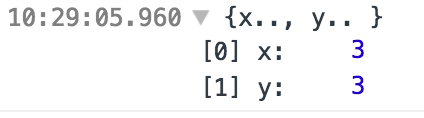

This release is a minor release but with some nice features:

The most exicited one is a new flag, "-bs-g"

By adding a flag into your `bsconfig.json`

```json
  "bsc-flags" : ["-bs-g"],
```
Suppose your code is like this:


```ocaml
[%%debugger.chrome]

type u = {
  x : int;
  y: int
}

let () = Js.log {x = 3; y =  3}
```

The extension `[%%debugger.chrome]` is a flag to turn on the debugger support conditionally, it will not generate any code when you don't have `-bs-g` flag turned on.

Now, either on your chrome browser or Node debugger using chrome dev tools, you will see a more meaningful output:



Note it does not only apply to record, but also makes almost all OCaml runtime values
look nicer in chrome devtools, for example: exception, record, local module, variant and polymorphic variant.

It is still experimental, you can contribute to the visualizer here:
https://github.com/BuckleScript/bucklescript/blob/master/jscomp/others/belt_Debug.ml


Another trivial change but you may get excited, now you can almost treat `Some` like a funciton : )

```ocaml
let f  x = x |. Some |. Some
```

A non-complete list of changes are available here:
https://github.com/BuckleScript/bucklescript/blob/master/Changes.md#310


